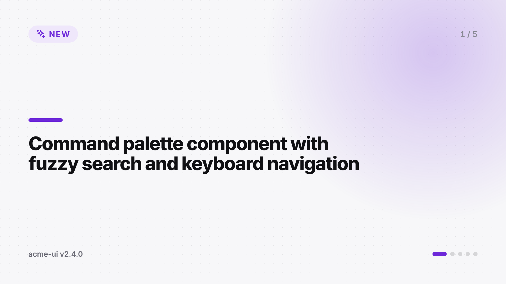
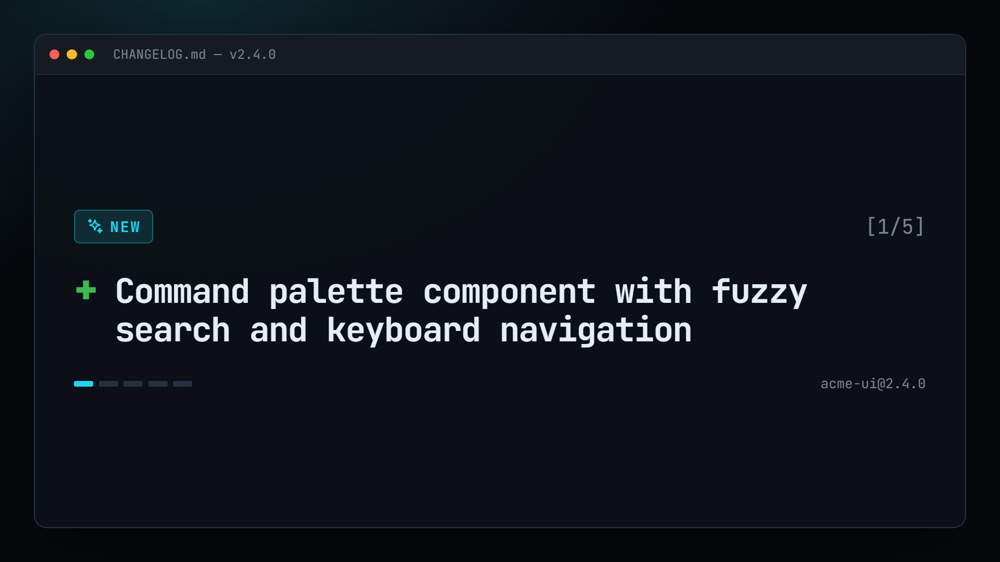
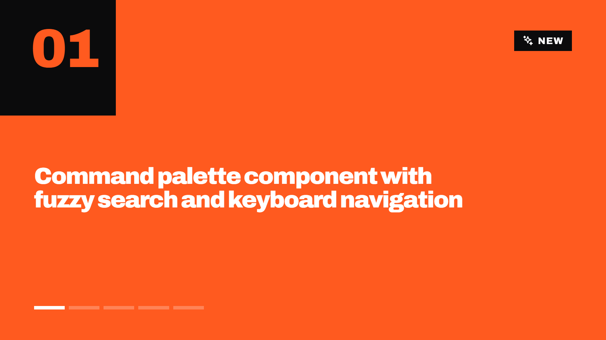

<div align="center">

# 🎬 shipreel

**Turn release notes into a short announcement video, automatically.**

Every time you publish a GitHub release, shipreel reads the notes (or your `CHANGELOG.md`), renders a branded 15–30 second MP4 and attaches it to the release. It's ready to post on X, LinkedIn, Instagram and YouTube Shorts.

[](https://www.npmjs.com/package/shipreel)
[](https://github.com/99proteam/shipreel/actions/workflows/ci.yml)
[](LICENSE)
[](https://buymeacoffee.com/99proteam)

### [▶ Try the live demo](https://99proteam.github.io/shipreel/) · [📦 npm](https://www.npmjs.com/package/shipreel) · [🚀 GitHub Action setup](#-2-minute-setup-github-action)

<a href="https://buymeacoffee.com/99proteam"></a>

<sub>shipreel is free and open source. If it helps your releases, <a href="https://buymeacoffee.com/99proteam">a coffee</a> keeps it going. ☕</sub>

[Install](#-installation) · [Quick start](#-2-minute-setup-github-action) · [CLI](#-cli) · [Config](#-configuration) · [Templates](#-templates) · [Custom templates](#-custom-templates) · [FAQ](#-faq--troubleshooting) · [Support](#-support-this-project)

</div>

---

<p align="center">
  
  <br>
  <sub>Rendered from <a href="tests/fixtures/keep-a-changelog.md">this changelog</a> with the <code>minimal</code> template (GIF preview; the real output is a crisp MP4).
  Every shipreel release ships its own announcement video, made with shipreel. See the <a href="https://github.com/99proteam/shipreel/releases/latest">latest release assets</a>.</sub>
</p>

## Why

Most release announcements are a link to a changelog nobody clicks. Video gets more engagement on every social platform, but nobody has time to edit one for each patch release. shipreel does it for you in CI, with zero effort after setup:

- **No server, no database, no account.** It runs inside GitHub Actions or on your machine.
- **Reads what you already write:** GitHub release bodies, Keep a Changelog, conventional-changelog / release-please / semantic-release, changesets, or any markdown file.
- **Picks the good stuff:** features first, max 5 highlights. It strips PR links, commit hashes and `@mentions`, and shortens long lines.
- **Every format at once:** landscape 1920×1080, square 1080×1080 and vertical 1080×1920 (Shorts / Reels / TikTok).
- **On brand:** 3 built-in templates, your color, logo, Google Font, call to action and optional background music.
- **Deterministic rendering:** HTML/CSS scenes are rendered frame by frame in headless Chromium and encoded with ffmpeg. The same input always gives the same video.

## 📥 Installation

There are three ways to use shipreel. All of them are free.

| Way | Best for | Install |
| --- | --- | --- |
| **GitHub Action** | Automatic video on every release | Nothing to install. Add one workflow file ([setup](#-2-minute-setup-github-action)) |
| **npx** (no install) | Trying it, one-off videos | `npx shipreel --changelog CHANGELOG.md` |
| **Project dependency** | Teams and npm scripts | `npm i -D shipreel` (or `pnpm add -D shipreel`, `yarn add -D shipreel`) |
| Global CLI | Using it across many repos | `npm i -g shipreel`, then run `shipreel` anywhere |

### Requirements (CLI only)

- **Node.js 20 or newer**. Check with `node -v`, and get it from [nodejs.org](https://nodejs.org).
- **Chromium for rendering.** Download it once:
  ```bash
  npx playwright install chromium
  # Linux servers / CI also need system libraries:
  npx playwright install --with-deps chromium
  ```
  If Chromium isn't there, shipreel falls back to an installed **Google Chrome** or **Microsoft Edge**.
- **ffmpeg** is bundled (`ffmpeg-static`). Nothing to install. To use your own build, set `SHIPREEL_FFMPEG=/path/to/ffmpeg`.

Works on Windows, macOS and Linux.

### Your first video in 60 seconds

```bash
cd your-project                      # a folder with a CHANGELOG.md
npx playwright install chromium      # one time only
npx shipreel --dry-run               # see which highlights will be used
npx shipreel                         # render landscape, square and vertical MP4s into ./videos
```

As a project script (`npm i -D shipreel`):

```json
{
  "scripts": {
    "video": "shipreel --changelog CHANGELOG.md --out videos",
    "video:preview": "shipreel preview"
  }
}
```

Then `npm run video`.

## 🚀 2-minute setup (GitHub Action)

**1.** Add `.github/workflows/release-video.yml`:

```yaml
name: Release video
on:
  release:
    types: [published]

permissions:
  contents: write # to attach the videos to the release

jobs:
  video:
    runs-on: ubuntu-latest
    steps:
      - uses: actions/checkout@v4
      - uses: 99proteam/shipreel@v1
        with:
          template: minimal # minimal | terminal | bold
```

**2.** (Optional) add a `shipreel.config.json` with your brand color and logo ([reference](#-configuration)).

**3.** Publish a release. A minute or two later the videos show up as assets on the release:

```
my-project-v2.4.0-landscape.mp4
my-project-v2.4.0-square.mp4
my-project-v2.4.0-vertical.mp4
```

### Action inputs

| Input | Default | Description |
| --- | --- | --- |
| `template` | from config, else `minimal` | `minimal`, `terminal`, `bold` or a path to a custom template folder |
| `sizes` | from config, else all three | Comma-separated: `landscape,square,vertical` or `WIDTHxHEIGHT` |
| `config` | `shipreel.config.json` | Path to a config file |
| `upload` | `true` | Attach videos to the release |
| `github-token` | `${{ github.token }}` | Needs `contents: write` to upload |
| `tag` | | Release tag to render when not triggered by a `release` event (e.g. `workflow_dispatch`) |
| `changelog` | | Read notes from this `CHANGELOG.md` instead of the release body |
| `output-dir` | `shipreel-videos` | Where videos are written |

### Action outputs

| Output | Description |
| --- | --- |
| `videos` | Newline-separated video paths |
| `videos-json` | JSON array of video paths |
| `video` | First video path |
| `asset-urls` | Download URLs of the uploaded release assets |

The job summary also lists the selected highlights and links to every video. A ready-to-copy workflow with `workflow_dispatch` and artifact upload lives in [`examples/release-video.yml`](examples/release-video.yml).

## 💻 CLI

Requires Node.js 20+. The first run needs a Chromium build (`npx playwright install chromium`). shipreel also falls back to an installed Chrome or Edge.

```bash
# From a changelog (latest released version, or pick one)
npx shipreel --changelog CHANGELOG.md --version 2.4.0 -o ./videos

# From a GitHub release (token from GITHUB_TOKEN for private repos / rate limits)
npx shipreel --release v2.4.0 --repo owner/name

# From any markdown release notes
npx shipreel --notes NOTES.md --version 2.4.0

# Preview scenes in the browser before rendering (scrub, play, switch sizes)
npx shipreel preview --changelog CHANGELOG.md

# See which highlights would be used, without rendering
npx shipreel --changelog CHANGELOG.md --dry-run
```

| Option | Description |
| --- | --- |
| `-c, --changelog <file>` | CHANGELOG.md to read (default `./CHANGELOG.md`) |
| `--notes <file>` | Plain markdown release notes |
| `--version <version>` | Version to pick from the changelog (default: latest released) |
| `--release <tag>` / `--repo <owner/name>` | Fetch the notes of a GitHub release (`latest` works) |
| `--config <file>` | Config file path |
| `-t, --template <name\|path>` | Template |
| `-s, --sizes <list>` | `landscape,square,vertical` or `WIDTHxHEIGHT` |
| `--name`, `--brand-color`, `--cta`, `--fps`, `--max-items` | Override config values |
| `-o, --out <dir>` | Output directory (default `./videos`) |
| `--dry-run` | Print highlights and timing as JSON |
| `--json` | Print rendered files as JSON |
| `preview -p, --port <port>` | Preview server port (default `4848`), `--no-open` to skip opening the browser |

## ⚙️ Configuration

Put a `shipreel.config.json` in your repo root, or a `"shipreel"` key in `package.json`. CLI flags and Action inputs override it. Paths are relative to the config file.

```json
{
  "template": "minimal",
  "brandColor": "#6d28d9",
  "logo": "./assets/logo.svg",
  "font": "Inter",
  "sizes": ["landscape", "square", "vertical"],
  "cta": "npm i my-project@latest",
  "maxItems": 5,
  "music": "./assets/music.mp3"
}
```

| Key | Type | Default | Description |
| --- | --- | --- | --- |
| `name` | string | `package.json` name, else repo name | Project name shown in the video |
| `template` | string | `minimal` | `minimal`, `terminal`, `bold` or a path to a custom template folder |
| `brandColor` | hex | template default | Accent color, e.g. `#6d28d9` |
| `logo` | path | monogram | SVG, PNG, JPG, WebP or GIF |
| `font` | string | template default | Any [Google Font](https://fonts.google.com) name, or `system-ui` for no web font |
| `sizes` | string[] | all three | `landscape` (1920×1080), `square` (1080×1080), `vertical` (1080×1920) or `WIDTHxHEIGHT` |
| `cta` | string | `npm i <name>@latest` or homepage | Outro call to action (commands get a `$` prompt) |
| `ctaSecondary` | string | `Star us on GitHub` | Second outro line |
| `url` | string | `package.json` homepage | Website shown when there is no repo |
| `repo` | string | from `package.json` / `GITHUB_REPOSITORY` | `owner/name` |
| `maxItems` | number | `5` | Maximum highlight scenes (1–10) |
| `maxChars` | number | `72` | Highlights longer than this are shortened |
| `music` | path | none | Background music (your own file). Looped, faded and trimmed to the video |
| `fps` | number | `30` | Frames per second |
| `minDuration` / `maxDuration` | seconds | `15` / `30` | Video length bounds |
| `outDir` | path | `videos` | CLI output directory |
| `changelog` | path | `CHANGELOG.md` | Default changelog for the CLI |

### Video structure

| Scene | Length | Content |
| --- | --- | --- |
| Intro | 2s | Logo, project name, "v2.4.0 is out" |
| Highlights | 2.5s each | One feature per scene: big text, icon, progress |
| Fixes | 2s | "+ 12 bug fixes" (only when there are fixes) |
| Outro | 3s | Call to action + "Star us on GitHub" |

Short releases are stretched to `minDuration`. Long ones are squeezed to `maxDuration`, and highlights are dropped only as a last resort.

## 🎨 Templates

| `minimal` | `terminal` | `bold` |
| --- | --- | --- |
|  |  |  |
| Clean light design with one brand accent | Dark code style with typed commands and a blinking cursor | Big type, brand color blocks, hard wipes |

## 🧩 Custom templates

A template is a folder with one HTML file per scene and a stylesheet:

```
my-template/
├── template.json     # name, default font and color (optional)
├── intro.html
├── highlight.html
├── fixes.html
├── outro.html
└── styles.css        # plus any images/fonts it references
```

Scenes are HTML fragments with `{{variables}}`, animated with plain CSS animations. shipreel pauses and seeks every animation per frame, so your animations render the same every time:

```html
<!-- highlight.html -->
<p class="label">{{kindLabel}} · {{index}}/{{total}}</p>
<h2 class="text size-{{textSize}}" data-split="words">{{text}}</h2>
```

```css
.text .sr-word { animation: rise .5s both; animation-delay: calc(.2s + var(--i) * 50ms); }
@keyframes rise { from { opacity: 0; transform: translateY(3vmin); } }
```

Use it with `"template": "./my-template"` and iterate with `npx shipreel preview` (press **Reload** after editing). The full variable list, helpers and rules are in [docs/templates.md](docs/templates.md). There is a complete example in [`examples/custom-template`](examples/custom-template).

## 📦 Library

```ts
import { loadConfig, findRelease, buildPlan, renderVideos } from 'shipreel';
import { readFileSync } from 'node:fs';

const config = loadConfig({ overrides: { template: 'bold', sizes: 'vertical' } });
const release = findRelease(readFileSync('CHANGELOG.md', 'utf8'), '2.4.0')!;
const videos = await renderVideos(buildPlan(release, config));
console.log(videos.map((v) => v.file));
```

Also exported: `parseChangelog`, `parseReleaseNotes`, `cleanItem`, `selectHighlights`, `buildTimeline`, `fetchRelease`, `uploadReleaseAsset`, `renderSceneDocument` and more (fully typed).

## 🛠️ How it works

1. **Parse** the notes into releases and items (features, fixes, performance, breaking, other).
2. **Select** up to 5 highlights (features first) and clean them up. Fixes become a count.
3. **Plan** scene timing in whole frames (15–30s total).
4. **Render**: each scene is an HTML page served locally to headless Chromium (Playwright). For every frame, `document.getAnimations()` are paused and their `currentTime` is set, then a screenshot is taken.
5. **Encode**: frames are piped into ffmpeg (`ffmpeg-static`), producing H.264 / yuv420p / faststart MP4s that every social platform accepts.

## ❓ FAQ & troubleshooting

<details>
<summary><b>"Could not launch Chromium"</b></summary>

Run `npx playwright install chromium` (on Linux CI: `npx playwright install --with-deps chromium`). Or install Google Chrome. shipreel uses it automatically. You can also point to any Chromium build with `SHIPREEL_CHROMIUM=/path/to/chrome`.
</details>

<details>
<summary><b>The Action fails with 403 when uploading</b></summary>

Give the workflow write access to releases:

```yaml
permissions:
  contents: write
```
</details>

<details>
<summary><b>Which highlights will be picked?</b></summary>

Run `npx shipreel --dry-run`, or paste your notes into the [live demo](https://99proteam.github.io/shipreel/). Features come first, then performance, breaking changes and other changes, up to `maxItems` (5). Fixes are shown as a count. Docs, chores, CI and dependency bumps are ignored.
</details>

<details>
<summary><b>My changelog format isn't detected</b></summary>

shipreel understands version headings like `## [1.2.0] - 2024-01-01`, `## 1.2.0 (2024-01-01)`, `# [1.2.0](link) (date)`, `## v1.2.0` and `## pkg@1.2.0`, plus sections such as *Added / Features / Fixed / Bug Fixes / Performance / Breaking Changes*. If yours isn't detected, use `--notes file.md --version 1.2.0`, and please [open an issue](https://github.com/99proteam/shipreel/issues/new) with a sample.
</details>

<details>
<summary><b>Can I render a past release?</b></summary>

Yes. Use `npx shipreel --release v1.2.0 --repo owner/name`, or run the Action with `workflow_dispatch` and the `tag` input (see [`examples/release-video.yml`](examples/release-video.yml)).
</details>

<details>
<summary><b>How long does rendering take?</b></summary>

About 30–40 seconds per 1080p size on a GitHub-hosted runner. Rendering only the sizes you need (`sizes: vertical`) is faster.
</details>

<details>
<summary><b>Does it cost anything?</b></summary>

No. shipreel is MIT-licensed, runs on free GitHub Actions minutes for public repos, and doesn't call any paid API.
</details>

## 💜 Support this project

shipreel is free and MIT-licensed, built and maintained in spare time. If it saves you time on every release, please consider supporting it:

<p align="center">
  <a href="https://buymeacoffee.com/99proteam"></a>
</p>

| Tier | Amount | You get |
| --- | --- | --- |
| ☕ Coffee | $5 one-time | Our thanks, and a faster release cycle |
| 🍕 Supporter | $10 / month | Your name in the Supporters list below |
| 🚀 Sponsor | $50 / month | Your logo in this README, plus priority on issues |
| 🏆 Partner | $200 / month | Large logo, a custom template for your brand, direct support |

Other ways to help: ⭐ star the repo, share a video you made with shipreel, or [contribute a template](CONTRIBUTING.md).

### Supporters

_Be the first!_ [buymeacoffee.com/99proteam](https://buymeacoffee.com/99proteam)

## 🤝 Contributing

Bug reports, parsers for more changelog styles and new templates are very welcome. See [CONTRIBUTING.md](CONTRIBUTING.md) and the [roadmap](ROADMAP.md).

## License

[MIT](LICENSE) © 99proteam
